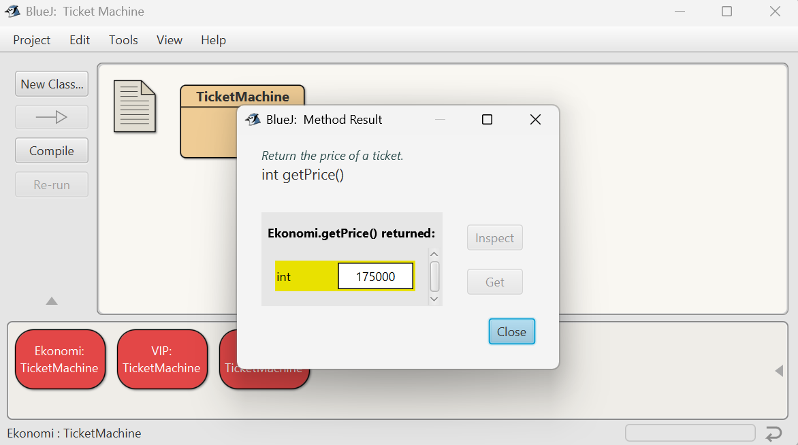
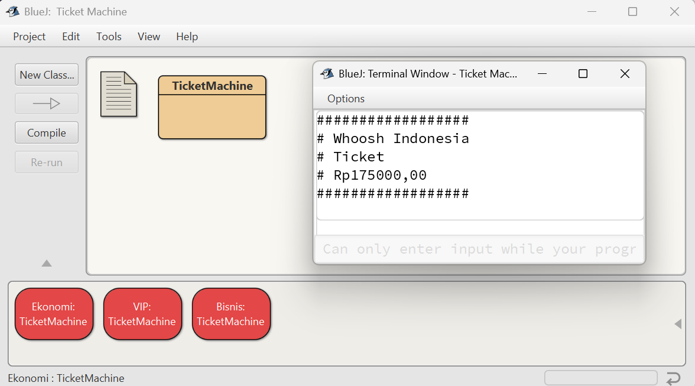
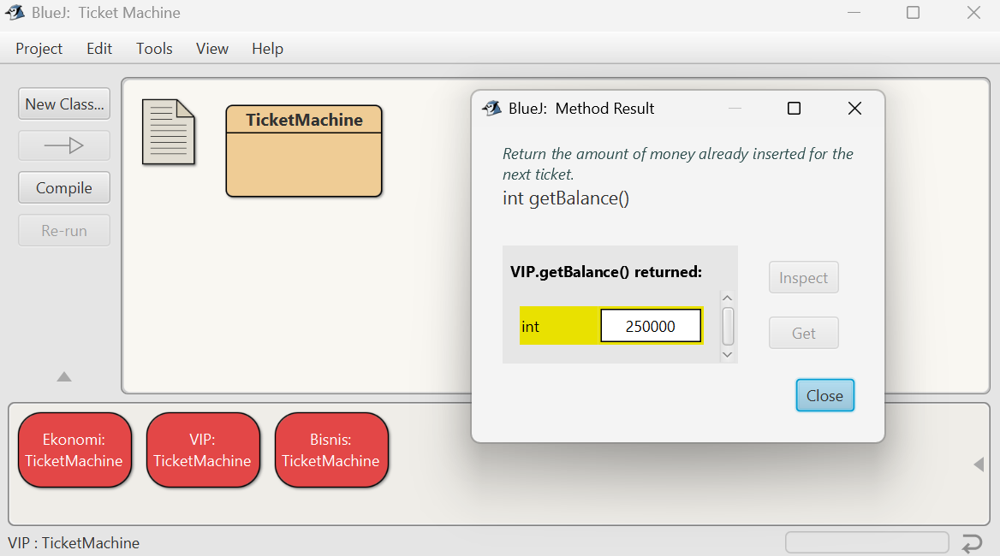

# TicketMachine (BlueJ)

*Author: Bara Semangat Rohmani (SID 5025241144)*

## Overview

This program models a ticket machine that issues flat-fare tickets. The ticket price is set via the constructor. An object of the `TicketMachine` class stores the ticket price, the balance (the amount of money inserted by the customer for the next ticket), and the total amount collected by the machine.

Main class: `TicketMachine` (Java)

## Class API

* **Constructor** `public TicketMachine(int cost)`

  * Creates a ticket machine with the given `cost`. Initializes `balance = 0`, `total = 0`.

* **Methods**

  * `public int getPrice()` — returns the ticket price (integer).
  * `public int getBalance()` — returns the current balance inserted for the next ticket.
  * `public void insertMoney(int amount)` — accepts money (only if `amount > 0`). If `amount` is non-positive, prints an error message to the terminal.
  * `public void printTicket()` — if `balance >= price`, prints a simulated ticket to the terminal, adds `price` to `total`, and reduces `balance` by `price`. If `balance < price`, prints a message showing how much more is needed.
  * `public int refundBalance()` — refunds the current balance to the customer (returns the value of `balance`) and resets `balance` to 0.

## How to Run (BlueJ)

1. Open BlueJ and create or open a project containing `TicketMachine.java`.
2. Compile the `TicketMachine` class.
3. Create a new instance of the class (right-click `TicketMachine` → `new TicketMachine...`) and enter a ticket price, e.g. `175000`.
4. On the created object (e.g., `Ekonomi: TicketMachine`), right-click → invoke methods such as `insertMoney`, `getBalance`, `getPrice`, `printTicket`, `refundBalance`.
5. Observe outputs in the Terminal window (for `printTicket`, a ticket representation will be shown).

## Example Output (from screenshot)
From the provided screenshots:

1. **Insert Money**: `insertMoney(200000)` called on object `Ekonomi: TicketMachine`.
2. **getBalance()**: returned `200000` — confirms the balance update works.
3. **getPrice()**: returned `175000` — the ticket price set for this instance.
4. **printTicket()**: terminal shows a printed ticket for `Rp175000,00` with a decorated border. `total` increases by `price` and `balance` decreases.
5. **refundBalance()**: returned `25000` — correct change after purchase (`200000 - 175000 = 25000`).

Execution order in screenshots:

* Create machine (`price = 175000`) → insert `200000` → check balance (`200000`) → print ticket (`Rp175000`) → refund (`25000`).

