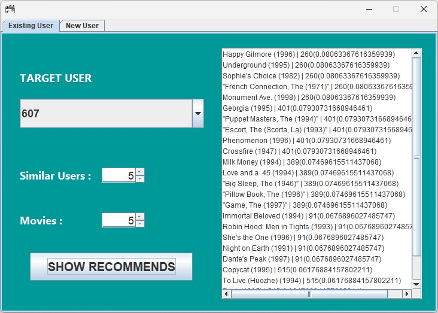
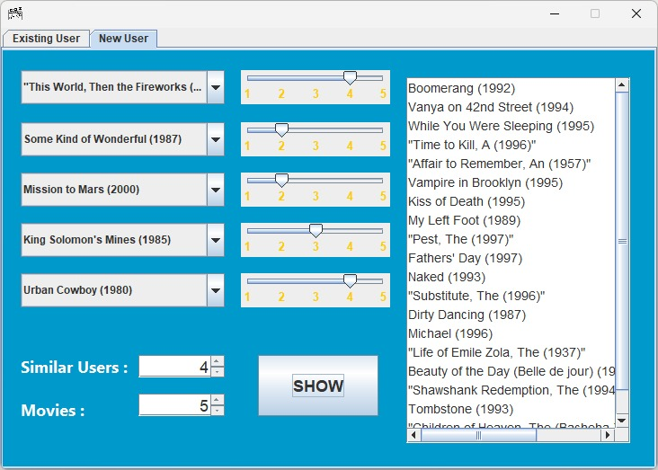
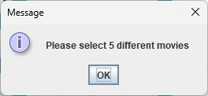

# 🎬 Movie Recommendation App - *Final Project Report*

## Project Info

| **Course** | **Class** | **Lecturer** | **Work Period** | 
| :--------: | :-------: | :----------: | :-------------: |
| `EF234302` Pemrograman Berorientasi Objek | PBO (B) | Fajar Baskoro, S.Kom., M.T. | 25 November—12 Desember 2025 |

## 📖 Project Overview

Aplikasi berbasis Java (GUI Swing) yang memberikan rekomendasi film secara personal kepada pengguna berdasarkan kemiripan rating dengan pengguna lain. Algoritma utama yang digunakan adalah *cosine similarity*, dan data pengguna serta film dikelola menggunakan struktur data Heap (`MaxHeap`) dan koleksi Java.

## 📌 Features

- Rekomendasi film untuk *user target* (dari file CSV)
- Simulasi *dummy user*: pengguna dapat memberi *rating* pada film acak dan mendapatkan rekomendasi
- Tampilan GUI interaktif berbasis Java Swing

<!-- ## 🚀 Installation & Usage

1. Clone repositori:
   ```bash
   git clone https://github.com/betasygma/learn-object-oriented-programming/tree/main/week-14/
   cd movie-recommendation-app
   ```
2. Compile semua file Java:
   ```bash
   javac *.java
   ```
3. Jalankan aplikasi:
   ```bash
   java GUI
   ```

<br> -->

## 🗂️ Project Structure

```
movie-recommendation-app/
├── GUI.java           # Main GUI aplikasi (Java Swing)
├── MaxHeap.java       # Struktur data heap untuk ranking kemiripan
├── Movie.java         # Representasi data film
├── Recommender.java   # Logika utama rekomendasi & similarity
├── User.java          # Representasi data user & rating
├── movies.csv         # Data film
├── main_data.csv      # Data rating user (user x movie)
└── target_user.csv    # Data user target
```

## 🏗️ Class Overview

- **GUI**: Menyediakan tampilan utama, input pengguna, dan menampilkan hasil rekomendasi.
- **Recommender**: Menghitung kemiripan antarpengguna (*cosine similarity*), memilih pengguna paling mirip, dan menghasilkan rekomendasi film.
- **User**: Menyimpan ID pengguna, *rating* film, dan skor kemiripan.
- **Movie**: Menyimpan ID, judul, dan genre film.
- **MaxHeap**: *Heap* untuk mengurutkan pengguna berdasarkan skor kemiripan.

## 🖼️ Screenshots

Tampilan utama aplikasi Movie Recommendation App (GUI Java Swing) terdiri dari tab rekomendasi untuk *target user* (`Existing User`) dan *dummy user* (`New User`). Berikut beberapa tampilan dan uji coba aplikasi.

| No | Gambar | Penjelasan |
|:--:|:------:|:----------:|
| 1  |  | Simulasi *target user*: pengguna memilih `user`, menekan tombol `SHOW RECOMMENDS`, lalu mendapatkan rekomendasi film. |
| 2  |  | Simulasi *dummy user*: pengguna memilih/mengisi *rating* pada beberapa film acak, lalu mendapatkan rekomendasi film. |
| 3  |  | Contoh pesan *error*/validasi jika data tidak lengkap atau input tidak valid. |

## 🔗 Resources

- **Source Code**: [Github Repository](./movie-recommendation-app/)
- **Demo Video**: [YouTube Link]()

## 👥 Contributors

Students of **Institut Teknologi Sepuluh Nopember** (ITS) — Undergraduate Program in **Informatics Engineering**

| Name                    | Student ID  | Role                                                      |
|:-----------------------:|:-----------:|:---------------------------------------------------------:|
| Bara Semangat Rohmani   | 5025241144  | QA Planner · Documentation & Report                       |
| Farrel Jatmiko Aji      | 5025241193  | Requirement Analysis · Research                           |
| Muhammad Akhdan Alwaafy | 5025241223  | Main Programmer · GUI Development · Integration & Testing |


## ⚖️ License
Public Domain (CC0).  
Do whatever you want with this project — no attribution required.
