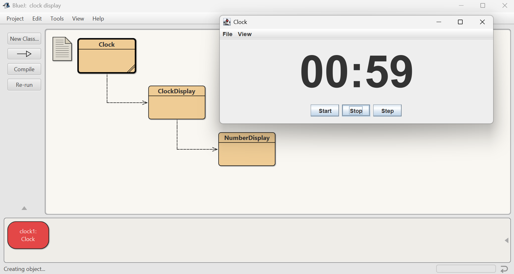

# Week 4 Assignment – Clock Display (Object Interaction)

## 📌 Project Overview

This assignment implements a **Clock Display** based on the *Object Interaction* chapter from *Objects First with Java*.
The project consists of a non-GUI model (`NumberDisplay`, `ClockDisplay`) and a GUI (`Clock`) that visualizes the digital clock. The GUI provides controls (Start / Stop / Step), menus (File, View), and a **24-hour / 12-hour (AM/PM)** display toggle — the format change affects only the GUI; the internal model stays as a 24-hour clock.

**Main files**

* `NumberDisplay.java`
* `ClockDisplay.java`
* `Clock.java` (GUI)

---

  

## 🎯 Objectives

* Implement `NumberDisplay` and `ClockDisplay` following the book.
* Build a Swing GUI to test and display the clock.
* Add a GUI-only 12-hour (AM/PM) display mode while keeping the internal model 24-hour.
* Document tests and results with screenshots.

---

  

## 🛠️ Technologies Used

* **Java SE** — core logic and GUI.
* **Swing** — GUI (`JFrame`, `JLabel`, `JMenuBar`, `javax.swing.Timer`).
* **BlueJ** or any Java IDE — compile & run.

---

  

## 🚀 Features

* `NumberDisplay` with increment and rollover behavior.
* `ClockDisplay` (24-hour) with `timeTick()`, `setTime()`, `getTime()`.
* `Clock` GUI:

  * Start / Stop (uses `javax.swing.Timer`)
  * Step — advance one minute (calls `timeTick()`)
  * Menu File → About, Quit (Ctrl+Q)
  * Menu View → toggle **12-hour (AM/PM)** (conversion done only for display)
  * Layout & sizing to prevent label clipping (use `setPreferredSize` / `pack()`).

---

  

## 📸 Screenshots

Each screenshot below documents an important test or UI action.

1. **Create a new Clock** (`new Clock()` via BlueJ — right-click the `Clock` class).
   
   
   

2. **File → About Clock...** (About dialog displayed).
   
   

3. **Start and Stop** (timer running and then stopped).
   
   

4. **Step at 00:59 → 01:00** (demonstrates minute rollover increments the hour).
   

5. **View → 12-hour (AM/PM)** when internal time is `15:07` → GUI shows `3:07 PM`.
   
   

6. **Disable AM/PM** (toggle back to 24-hour display).
   
   

7. **File → Quit (Ctrl+Q)** — exit application.
   

---

  

## 📋 Detailed Tests & Results

**Test 1 — Instantiate GUI**

* *Steps:* In BlueJ, right-click `Clock` → `new Clock()`
* *Expected:* GUI window opens showing `00:00`.
* *Result:* PASS — GUI starts, initial label shows `00:00`.

**Test 2 — About dialog**

* *Steps:* Menu File → About Clock...
* *Expected:* Information dialog appears.
* *Result:* PASS — About dialog displayed.

**Test 3 — Start / Stop**

* *Steps:* Press Start (timer begins), press Stop (timer halts).
* *Expected:* Start begins periodic `timeTick()` calls; Stop halts them.
* *Result:* PASS — Timer starts and stops correctly. (Default delay ≈ 300 ms per tick to speed testing.)

**Test 4 — Step & minute→hour rollover**

* *Steps:* Set internal time to `00:59` (via inspector or prior steps), press Step.
* *Expected:* Minute rolls over to `00` and hour increments → `01:00`.
* *Result:* PASS — `ClockDisplay.timeTick()` increments minutes; on rollover minutes `== 0` triggers `hours.increment()`.

**Test 5 — 12-hour (AM/PM) GUI-only display**

* *Steps:* Ensure internal time `15:07`, toggle View → 12-hour (AM/PM).
* *Expected:* Label shows `3:07 PM` while internal model remains `15:07`.
* *Result:* PASS — GUI converts `HH:MM` → `h:MM AM/PM` (`hour % 12`, `0 → 12`).

**Test 6 — Disable AM/PM**

* *Steps:* Uncheck View → 12-hour (AM/PM).
* *Expected:* GUI returns to `HH:MM` 24-hour format.
* *Result:* PASS — Label reverts to `15:07`.

**Test 7 — Quit**

* *Steps:* File → Quit (or Ctrl+Q)
* *Expected:* Application stops (timer stopped, window closed).
* *Result:* PASS — Application exits cleanly.

---

  

## 🔧 Key Implementation Notes

* **Model vs View separation:** The `ClockDisplay` is the single source of truth (24-hour). The GUI applies a conversion layer for 12-hour display only.
* **Safe Swing updates:** Use `javax.swing.Timer` so updates run on the Event Dispatch Thread (EDT). Avoid updating Swing components from background threads.
* **Label sizing:** For large fonts avoid clipping (ellipsis) by setting preferred size or giving the frame enough initial size before `pack()`/showing.
* **Rollover logic:** `NumberDisplay.increment()` uses modulo arithmetic (`(value + 1) % limit`). `ClockDisplay.timeTick()` increments minutes and increments hours when minutes roll over to zero.

---

  

## 📚 Lessons Learned

* Modular design (separating small displays from the full clock) simplifies testing and maintenance.
* UI formatting (12-hour vs 24-hour) is best done in the view layer to keep the model stable.
* `javax.swing.Timer` is the correct choice for periodic GUI updates in Swing.
* Pay attention to component sizing: large fonts + small containers cause clipped text or ellipses.
