# 📑 Laporan Project – Evaluasi Tengah Semester Gasal 2025/2026  
**Author:** Bara Semangat Rohmani (NRP 5025241144)  

 

## 📌 Project Overview  
Project ini berfokus pada pembuatan **Simulasi Vending Snack Machine** menggunakan bahasa pemrograman **Java** di lingkungan **BlueJ**.  

Aplikasi ini mensimulasikan mesin penjual otomatis yang dapat:  
1. Menampilkan daftar produk (snack & minuman).  
2. Memproses pemilihan produk oleh pengguna.  
3. Menghitung dan memverifikasi pembayaran.  
4. Mengeluarkan produk serta memberikan kembalian.  
5. Menyimpan log transaksi.  
6. Memberikan peringatan jika stok produk menipis agar admin melakukan refill.  
7. Menyediakan menu admin untuk melihat laporan transaksi dan mengisi ulang stok.  

👉 Program ini diimplementasikan dengan konsep **Object-Oriented Programming (OOP)**: class, object, inheritance, encapsulation, dan penggunaan koleksi (`ArrayList`).  

👉 Link kode (struktur file BlueJ):  
- [`Product.java`](Product.java)
- [`Inventory.java`](Inventory.java)
- [`Transaction.java`](Transaction.java)
- [`TransactionLog.java`](TransactionLog.java)
- [`PaymentProcessor.java`](PaymentProcessor.java)
- [`VendingMachine.java`](VendingMachine.java)
- [`VendingSim.java`](VendingSim.java)

👉 Simulasi dijalankan melalui **BlueJ Terminal/Console**.

👉 Tautan video penjelasan: [YouTube](https://youtu.be/jvncUS8oN1M)

---

 

## 🎯 Objectives  
- Membuat aplikasi simulasi mesin penjual otomatis berbasis **OOP**.  
- Melatih penggunaan **class diagram** dan **object diagram** untuk perancangan sistem.  
- Mengimplementasikan **ArrayList** untuk manajemen koleksi produk dan transaksi.  
- Menggunakan **encapsulation** dan **method interaction** antar objek.  
- Menyediakan fitur **admin console** untuk refill stok dan laporan transaksi.  

---

 

## 🛠️ Technologies Used  
- **Java (BlueJ IDE)** → implementasi OOP dan simulasi.  
- **ArrayList** → menyimpan produk dan transaksi.  
- **Scanner** → input dari pengguna.  
- **System.out** → output simulasi ke console.  

---

 

## 🚀 Features Implemented  
1. **Menu Produk**: menampilkan daftar snack & minuman dengan harga dan stok.  
2. **Pembelian Produk**: pengguna memilih produk berdasarkan ID.  
3. **Pembayaran**: menerima input uang bertahap hingga mencukupi harga.  
4. **Keluaran Produk & Kembalian**: produk dikeluarkan, kembalian dihitung otomatis.  
5. **Log Transaksi**: setiap pembelian dicatat dengan detail (produk, harga, uang masuk, kembalian, timestamp).  
6. **Peringatan Stok Rendah**: sistem memberi notifikasi jika stok ≤ batas minimum.  
7. **Admin Console**:  
   - Melihat laporan transaksi.  
   - Melakukan refill produk berdasarkan ID.  

---

 

## 📚 Screenshots

|  No  | Gambar | Deskripsi                                               |
| --- |---------|------------------------------------------------------|
|  1 | 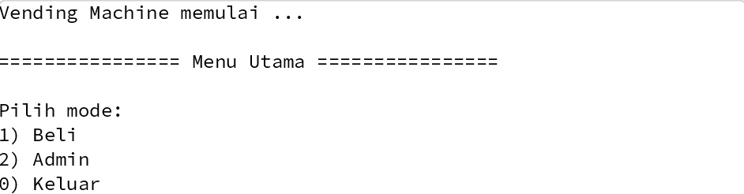 | **Tampilan awal dengan menjalankan program** dengan **menjalankan `VendingSim.main`** untuk **menampilkan menu utama: 1) Buy  2) Admin  0) Exit**.  |
|  2 | 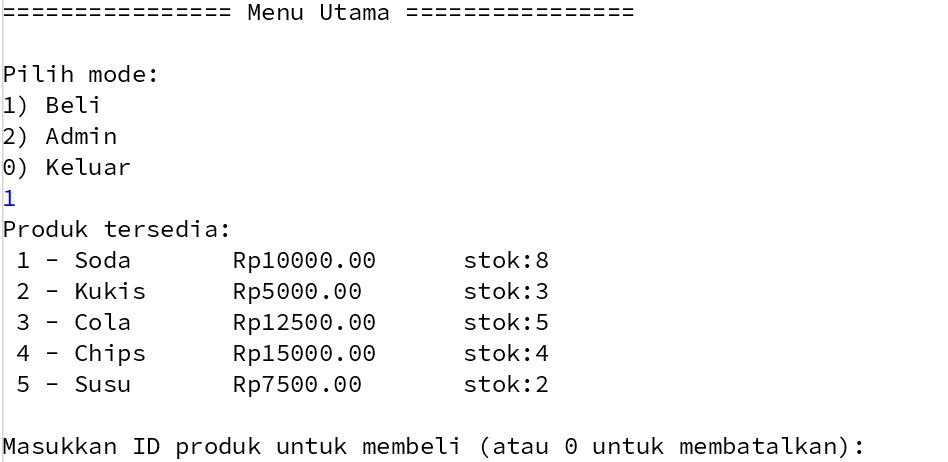 | **Menampilkan daftar produk** dengan **memilih opsi `1) Buy`** untuk **menampilkan daftar produk dengan ID, nama, harga, dan stok**.   |
|  3 | 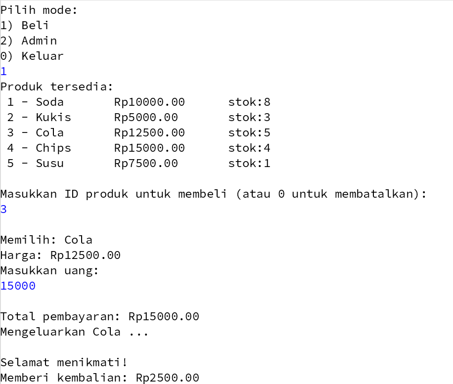 | **Pembelian produk berhasil** dengan **memasukkan ID produk dan uang yang sama/lebih besar dari harga** untuk **mengeluarkan produk dan menampilkan kembalian jika ada**.   |
|  4 | 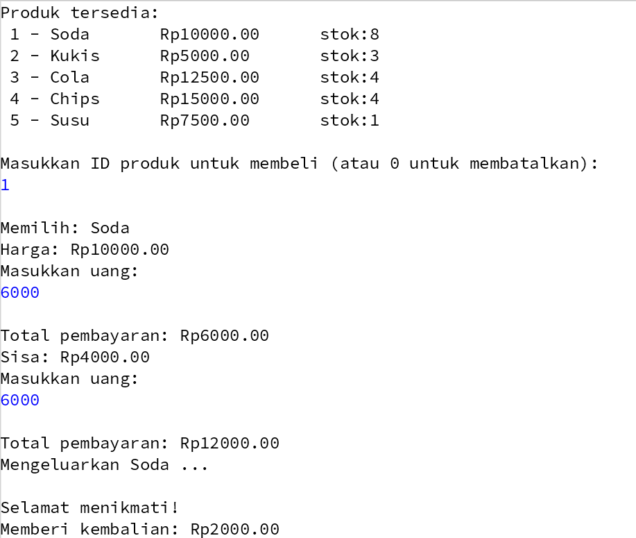 |  |
|  5 | 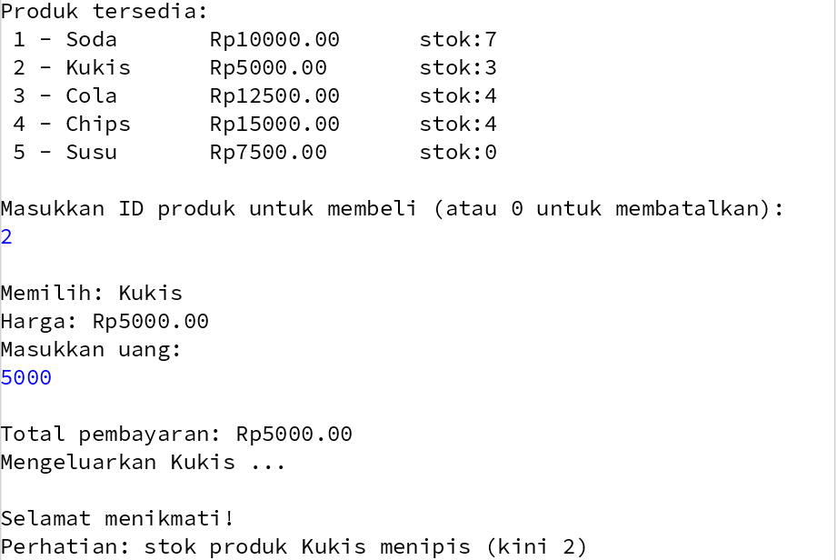 |  |
|  6 | 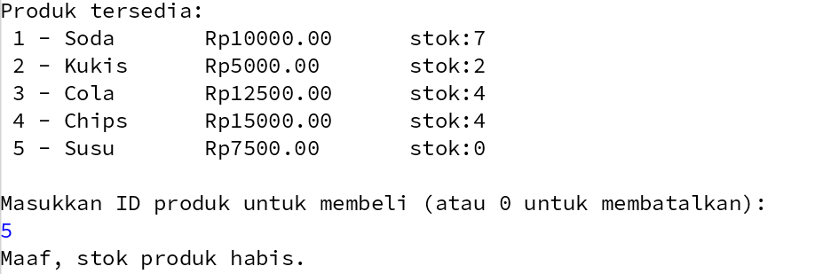 |  |
|  7 | 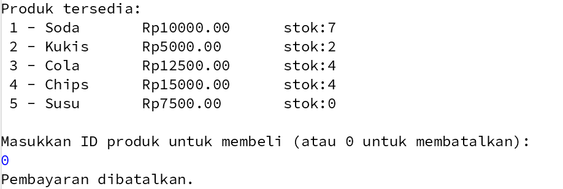 |  |
|  8 | 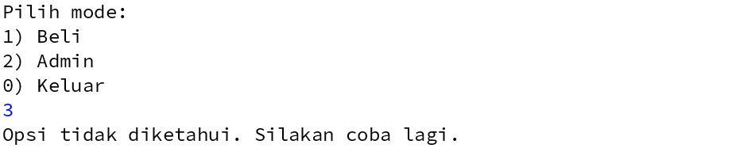 |  |
|  9 | 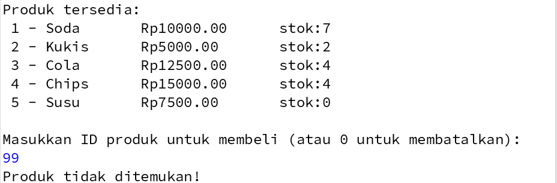 |  |
| 10 | 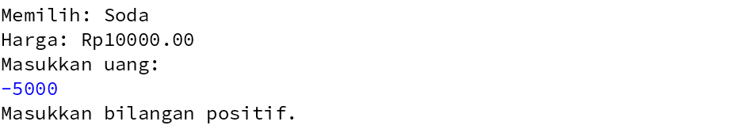 |  |
| 11 | 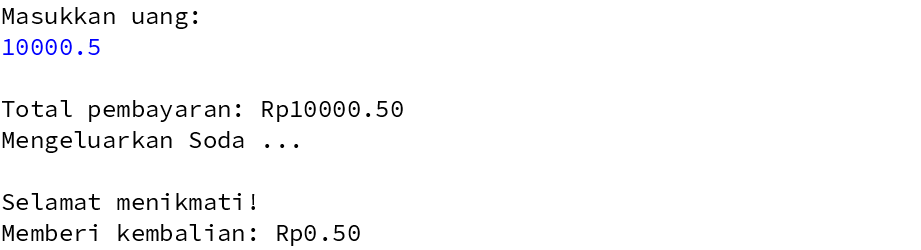 |  |
| 12 | 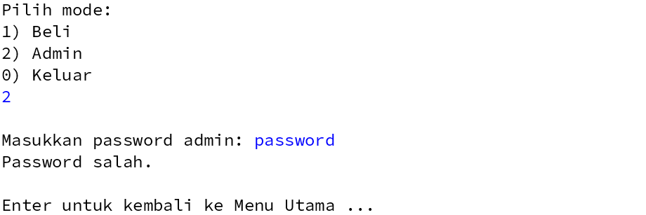 |  |
| 13 | 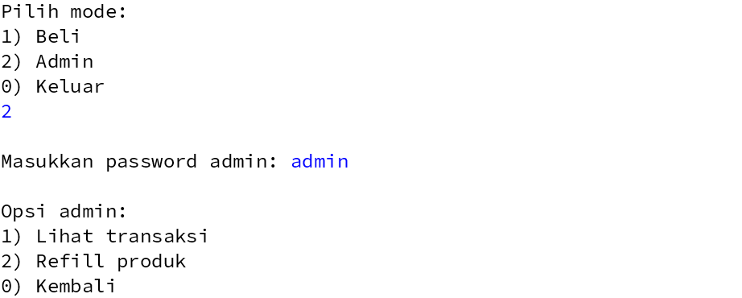 |  |
| 14 | 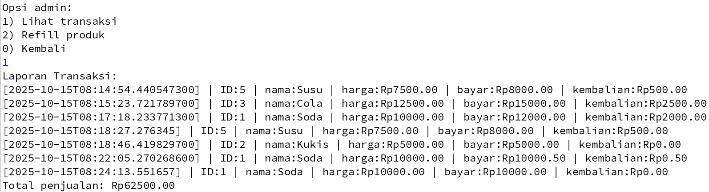 |  |
| 15 | 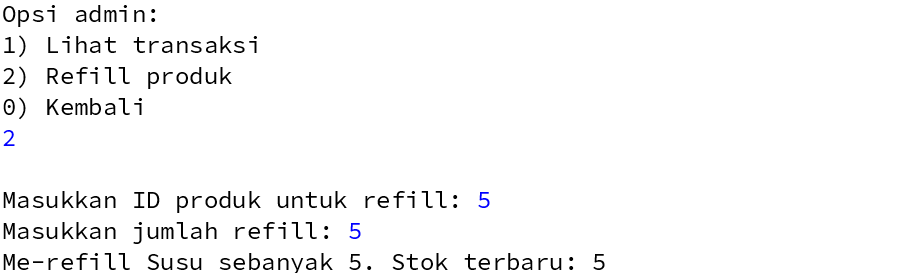 |  |
| 16 | 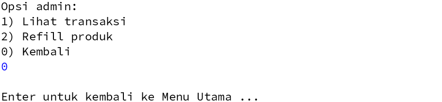 |  |
| 17 | 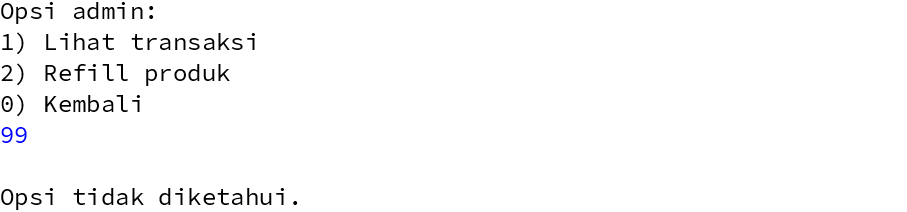 |  |
| 18 | 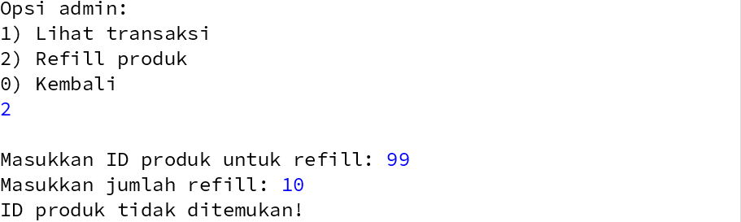 |  |
| 19 | 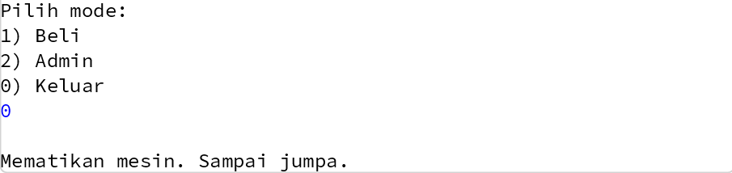 |  |

---

 

## 📚 Lessons Learned  
- Pentingnya **perancangan class diagram** sebelum coding agar relasi antar class jelas.  
- Cara menggunakan **ArrayList** untuk menyimpan dan mengelola data dinamis.  
- Pentingnya **validasi input** (misalnya pengecekan index dan parsing angka).  
- Implementasi **encapsulation** untuk menjaga agar field hanya bisa diakses lewat method.  
- Penggunaan **polymorphism sederhana** (misalnya objek `Product` dalam `ArrayList`).  
- Teknik debugging di BlueJ menggunakan **breakpoint** dan **step into** untuk melacak alur eksekusi.  

---

 

## 📝 Reflection  
Saya belajar bahwa membangun aplikasi berbasis OOP membutuhkan **pembagian tanggung jawab class yang jelas**. Dengan memisahkan `Product`, `Inventory`, `Transaction`, dan `VendingMachine`, kode menjadi lebih mudah dipahami, diuji, dan dikembangkan.  
Saya juga menyadari bahwa detail kecil seperti **validasi input pengguna, pesan error yang jelas, dan log transaksi** sangat berpengaruh pada pengalaman simulasi.  
Dengan project ini, saya semakin memahami bagaimana konsep **abstraction, encapsulation, object interaction, dan collection** dapat diterapkan dalam kasus nyata.  
